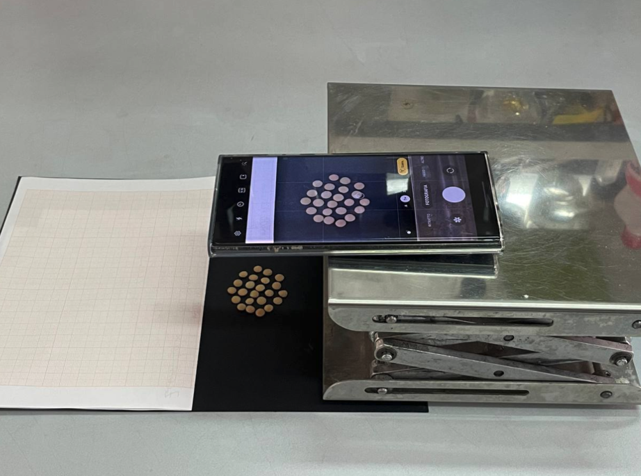
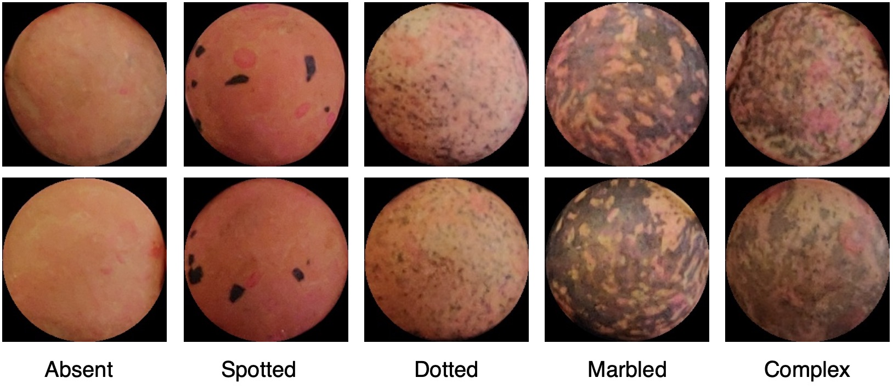

# unconstrainedLentils
The dataset provide 64 images of lentils seeds randomly positioned on a dark background in unconstrained light conditions.

## Overviev

Lentil (Lens culinaris Medik.) is among the most common cultivated grain legumes and one of the oldest domesticated crops worldwide. While Canada, India, Turkey, and the United States are the main lentil-producing areas [1], the countries surrounding the Mediterranean basin hold the largest quote of the genetic variation for the species

The acquisition image campaign was carried out under hybrid lighting systems with the use of available natural daylight, sometimes supplemented with artificial light to meet the required level of seeds illumination. The focus and iris parameters of the camera were set at fixed values.
The images were acquired from a camera of a smartphone positioned on a height-adjustable holding structure (camera support) on different days. The camera support was moved between acquisition campaigns, and we found that its repositioning contained a non-negligible error for the purposes of the evaluation process here described. This means that the images in some cases showed a different scaling factor that was handled by the algorithms. In Figure 1 the acquisition setup is shown.


## Dataset
The final datasets consists of 64 images of lentils seeds randomly positioned on a dark background and including graph paper devoted to be a measure reference.
Each single image is labeled among 5 classes: absent, dotted, spotted, marbled, complex.
The **dataset** folder contains original images and classes annotation provided as a csv file.



## Citation 
```
The paper containing the first dataset usage and release will be made available soon
 ```